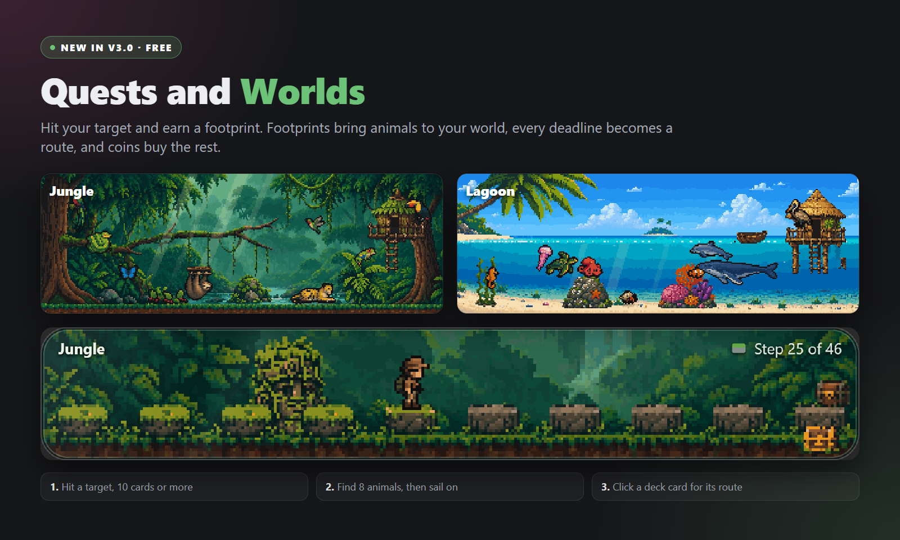

# Deckline

**Smart deadlines for Anki: know exactly how many cards to study today, every day.**

---

Deckline helps you finish Anki decks before a chosen **deadline** by turning the remaining work into a clear **daily target**. It shows what to do today, whether you're on pace, and how your deadline progress looks, right inside Anki, without touching Anki's own scheduler.

> **Deckline never changes how Anki schedules your cards.** It doesn't touch intervals, ease, leeches, or your algorithm (FSRS or SM-2). It only reads your collection to calculate a plan. Uninstalling Deckline leaves your cards exactly as they are.

## What Deckline does

- Creates a **deadline-based study plan** per deck, split into a **NEW** phase and a **REVIEW** phase.
- Converts remaining work into a **stable daily target** that adjusts for rest days, skipped weekends and vacation/time-off days.
- Shows **today's progress** on the Deck Overview and the Review screen, and **overall deadline progress** on the Deck Browser.
- Includes subdecks automatically in targets, progress and today's counts.
- Supports start dates, custom display names, expected total cards, and manual daily target overrides.
- Shows a **live daily pace** while you pick your dates: new cards a day until the cut-off, then reviews a day until the deadline, updating as you type. The same card runs backwards too, turning a pace you choose into the dates that deliver it.
- **Quests and Worlds** (new in v3.0, free, off by default): every day you hit a deadline's target (10 cards or more) earns a footprint, footprints bring animals to a jungle at the bottom of the deck list, and every deadline is a route of stones on the back of its deck card. Find all eight jungle animals and your footprints take you on to a second world, the Lagoon. See [Quests and Worlds](#quests-and-worlds) below.
- Builds a **smart filtered deck** with exactly the cards you still need to hit today's target. Click the **NEW** or **REVIEW** phase button on a deck card, or the deck's name once that deck exists. If you run low before reaching today's target, an **Add** button appears next to *More* in the reviewer to top the deck back up with one click.

## What Deckline does *not* do

- Does not change Anki's scheduling (FSRS, SM-2, ease, intervals, leeches).
- Does not force cards to appear. It only reads your collection to calculate targets and feedback.

## Core concepts

- **Deadline**: the final date you want to finish a deck.
- **Cut-off date**: splits the plan into two phases:
  - **Phase 1: NEW → Cut-off**: finish introducing new cards early.
  - **Phase 2: REVIEW → Deadline**: get young cards to stick before the deadline.
- **Young vs. mature**: a card becomes mature once its interval reaches the **maturity threshold** (21 days by default, adjustable per deadline under *Planning → Mature after*).
- **Done today**: in the NEW phase, this is the new cards you've introduced today. In the REVIEW phase, a card only counts once it actually **matures** today (reaches that threshold). Cards you're still relearning don't inflate your progress, so the target always reflects genuine ground gained.
- **Mature after**: one number that sets both sides of REVIEW-phase progress. Cards below it are what's still left to do, and reaching it is what counts as done. Lower it for short deadlines (see the FAQ).
- **Counting mode** *(Planning → Daily target, beta)*: the default **Matured** mode counts REVIEW-phase progress as above. **Cards studied** counts every card you genuinely answer instead, in both phases, with the review workload added to the target on days that still have new cards. It's the better fit for a short deadline where nothing has time to mature; existing decks keep **Matured** until you change it.

## Getting started

1. Install Deckline from AnkiWeb (badge above) and restart Anki.
2. On the deck list, right-click a deck and choose **Deadline**, or click **Set a deadline** at the bottom of the Deckline column (open **Tools → Deckline settings** for the global view).
3. Set a deadline date and, if the deck has subdecks, whether they should count toward it.
4. Deckline now shows today's target on the deck list. Click the **NEW** or **REVIEW** badge on a deck card to instantly build a filtered "Today's Target" deck sized to exactly what you still need, and start studying.

## Where you see Deckline

| Location | What it shows |
| --- | --- |
| **Deck Browser cards** | Deck name, deadline status, phase badge (click to build a quick filtered deck), pending cards, today's progress, overall progress, and a status pill (On Track, Behind, Rest, Window closed, Complete). |
| **Deckline Home** | A dashboard inside the stats window: today's plan, a 7-day weekly rhythm, upcoming deadlines, and decks that need attention. Open it from the stats button in the topbar. |
| **Topbar** | Focus mode, sort options, a "behind only" filter, and the Timeline / Pomodoro panels. |
| **Main-screen bottom bar** | Smart messages and curated study facts (can be hidden in settings). |
| **Deck Overview** | Today's progress as *done / target*, with phase and rest-day context. |
| **Review screen** | A progress bar that updates live while you review, plus (Premium) a completion effect and Overdrive, and (free) the Add button on your quick filtered decks. |

## Quests and Worlds

New in v3.0. A small game on top of your deadlines, free and off by default. Turn it on under *Gamify → Quests and Worlds* in the settings. It never changes your targets or your cards.

- **Footprints**: every day you hit a deadline's target, with 10 cards or more, earns a footprint (at most five a day per world). A day you study on your phone or AnkiWeb counts too, once it syncs. A missed day never takes anything away.
- **A world that grows**: your world sits at the bottom of the Deckline column and starts as a bare jungle. Footprints bring animals: eight to find, two to choose from each time, and now and then one in a rare coat. Click an animal and it answers. The world follows your clock, from misty mornings to lanterns at night, when the day animals sleep.
- **Routes**: click a deck card and it turns over to that deadline's route, one stone for every study day. A chest stands on every tenth stone, and long routes get landmarks. Clear every stone and the end of the route lights up and pays coins. On a rest day your explorer sits by a campfire.
- **Coins and the shop**: chests, finished deadlines, clear routes and a weekly expedition pay coins. Spend them in the **Quests** window on a swing, a treehouse and more; point at an item to try it in your own world first.
- **Explorers**: eight characters can walk your routes: two to start with, two to save up for and four with Premium.
- **The Lagoon**: find all eight jungle animals and your next footprint takes you to the sea, a lagoon half above and half below the water, with eight new animals, a shop of its own and a beach path for your routes. A message in a bottle in the jungle river tells you it is coming.
- **Postcards and stats**: every deadline you archive sends a postcard of your world that day, kept in an album in the Quests window. The chart and the heatmap show a paw on every day that earned a footprint.

The **Quests** window (from the world card or the *Quests* tab in the topbar) has the animals, the shop, your routes, the postcards and a **Guide** with pictures.

**Premium adds** coins for your best Overdrive medal each day, a golden chest beside every wooden one, four more explorers, and the items and the ninth animal that finish both worlds (a waterfall, a red flower, lanterns and fireflies in the jungle; glass floats, glowing plankton, a sea anemone and a shipwreck in the lagoon). Everything else in Quests and Worlds is free.

## Stats window

Open it from the stats button in the topbar:

- **Home**: daily plan and 7-day weekly rhythm.
- **Metrics**: deadline activity and progress patterns across all your decks.
- **Chart**: recent done-vs-target per deck, with earned Overdrive medals and Quests footprints shown right on the bars (Premium adds an all-decks timeframe and a full deadline projection).
- **Heatmap**: per-deck study-day history, colored by progress against your daily targets.
- **Milestones**: rewards for consistency, plus a Quests block with Quests and Worlds on. Purely cosmetic, never affecting scheduling.
- **Archive**: completed deadlines with their full history, and a postcard for each one finished with Quests and Worlds on.

## Timeline & Pomodoro

- **Timeline** shows all your deadlines, cut-off dates, and custom dates (exams, trips, milestones) in one range view.
- **Pomodoro** *(Premium)* adds a focus/break timer with review-screen timing feedback, configurable break warnings, an end-of-session chime (testable, and can be switched off), a button to skip a break early, and the option to turn Pomodoro off entirely.

## Settings

Per deck: right-click a deck → **Deadline**. Global: **Tools → Deckline settings**.

| Page | What you configure |
| --- | --- |
| **Schedule** | Deck name, start date, cut-off date, deadline, and the **Daily pace** card. |
| **Planning** | Expected total cards, daily target counting mode, daily target override, day rollover, days off, time off (vacation days). |
| **Progress** | Progress bar visibility, time-estimate multipliers, streaks *(Premium)*. |
| **Gamify** | Quests and Worlds, and Overdrive *(Premium)*. |
| **Plugins** | Timeline, Pomodoro, bottom bar and review messages, deck card layout. |
| **Appearance** | Theme gallery (2 free, 13 Premium presets), card styling, custom deck icons (free unlock button available), deck and status colors *(Premium)*, completion effect *(Premium)*. |
| **Premium** | License code entry and a feature overview. |

## Free vs. Premium

Deckline is free to use for up to **3 deadlines** (or custom Timeline dates) at once, with two built-in themes (dark **Deckline** and light **Deckline Light**). Everything above is included, and so is the whole Planning page, time off (vacation days) too: always a full rest day (0% target), to block out longer stretches in advance. Premium removes that limit and adds:

- ♾️ **Unlimited deadlines**
- 🍅 **Pomodoro timer**, built into the review screen, with break warnings, an end-of-session chime, a skip-break button, and an off switch
- 🔥 **Streaks & milestone tracking** for staying consistent
- 🖼️ **Full custom deck icon pack**, plus custom deck and status colors
- ✍️ **A gallery of premium themes** (13 presets, including **Amethyst** and **Pistachio**), plus full custom color control
- 🎯 **Adjustable review bar checkpoints** (1-8, default 3): subtle pulses as you approach today's target, shown for any Premium account whether or not Overdrive is on.
- 🎮 **Overdrive**: once you hit today's target, the review bar resets so you chase bronze (130%), silver (160%) and gold (200%) medals, each with its own color and a live bonus counter. Earn a medal and the On Track pill on your deck list glows to match for the rest of the day, three Stats milestones track every medal you collect, and earned medals now show up right on the stats Chart.
- 🌴 **More for Quests and Worlds**: medals pay coins, a golden chest beside every wooden one on your routes, four more explorers, and the items and the ninth animal that finish both worlds
- ✨ **Completion effect** the instant you reach your daily target
- 📊 **Full deadline projection chart** and an all-decks timeframe view

Free users can also unlock hand-drawn custom icons and card blur/opacity controls (normally Premium-only) by leaving a quick review of Deckline on AnkiWeb. The unlock button is right there in the Appearance settings.

## How targets are calculated

1. Determine the current phase (NEW until the cut-off date, then REVIEW until the deadline).
2. Exclude rest days (skipped weekends, vacation/time-off days).
3. Apply the day-off learning amount for partial rest days.
4. Divide the remaining work by the remaining study days.
5. Compare today's done count against that quota and assign a status pill.

## Planning from a pace instead of a date

The **Daily pace** card on the Schedule page runs that calculation in both
directions.

**Current forecast** reads your dates back as cards per day, live while you type
them. Two numbers, because the plan has two halves: new cards a day until the
cut-off, then reviews a day until the deadline.

**Custom pace** runs the same sum backwards. Set the number you want for each
phase and Deckline returns the cut-off and the deadline that deliver both, ready
to apply to your date fields in one click.

There is a field per phase rather than one, because the cut-off is what sets how
long the REVIEW phase is. Moving only the deadline drags the cut-off along with
it, so the last stretch stays exactly as heavy as it was. A number per phase is
what lets you make the reviews lighter.

## FAQ

**Does Deckline modify FSRS or scheduling?**
No, it only provides planning and feedback on top of your existing scheduling.

**Do subdecks count?**
Yes, automatically: in targets, progress, and today's counts.

**Why does today's review count sometimes look lower than what I actually studied?**
In the REVIEW phase, a card only counts toward today once it reaches the maturity threshold (21 days by default). Cards you're still relearning come back later and don't inflate your progress in the meantime, so the number always reflects real ground gained, not just answered cards.

**My deadline is only two weeks away and I can never fill the review bar. Why?**
A card only counts once it reaches the maturity threshold, and at 21 days that is physically unreachable inside a two-week window. Two ways to fix it, under the deck's *Planning → Daily target*:
- Switch the counting mode to **Cards studied**. Every card you answer counts right away, in both phases, which is the better fit for a short cycle.
- Or lower *Mature after* instead. Seven days is a good starting point for a cram week; more of your reviews start counting straight away.

**Change it at the start of a study day.** That one number sets both sides of the calculation, but the two sides do not land at the same moment: today's *done* is recomputed immediately, while the daily *target* only picks up the new value on your next study day. Deckline deliberately never rewrites a target part-way through a day, so a mid-day change looks like only half of it worked.

*Mature after* and the **Cards studied** counting mode are both **beta settings**. They are new, and feedback is very welcome. One more thing worth knowing: raising *Mature after* never rewrites history, so past days keep the counts they were originally recorded with. Lowering it may raise the counts on past days, since those are recomputed from your review log.

**Is progress shown daily or as a total?**
Both: the Deck Overview, review bar and today counters are daily. The Deck Browser progress bar and deadline projections are cumulative.

## Troubleshooting

- **Overview progress bar missing**: check *Progress* settings → "Show daily progress bar in deck overview".
- **Review progress bar missing**: check *Progress* settings → "Show daily progress bar in review screen".
- **Targets seem off**: double-check the deadline dates, skipped weekends/vacation days, the day-off learning amount, and expected total cards.
- **Pomodoro unavailable**: it's a Premium feature and must be enabled in *Plugins* settings.

## Managing your plans

- **Edit**: right-click a deck → **Deadline**.
- **Complete**: use Deckline's completion flow once a deadline is finished.
- **Archive**: move completed plans into the stats archive automatically.
- **Clear**: right-click a deck → **Clear**.

## Quick tips

- Set the cut-off a few days before the final deadline to leave breathing room.
- Use "expected total cards" for decks that are still growing.
- Use Timeline for cross-deck planning around exam dates.
- Check Deckline Home before you start reviewing to see the day's plan at a glance.
- Use the review bar as your done-for-today indicator while studying.

---

Found a bug or have an idea? [Open an issue on GitHub](https://github.com/Kwinties/Deckline/issues).

If Deckline helps you stay on track, consider [supporting development on Ko-fi](https://ko-fi.com/s/d708f4b514).
